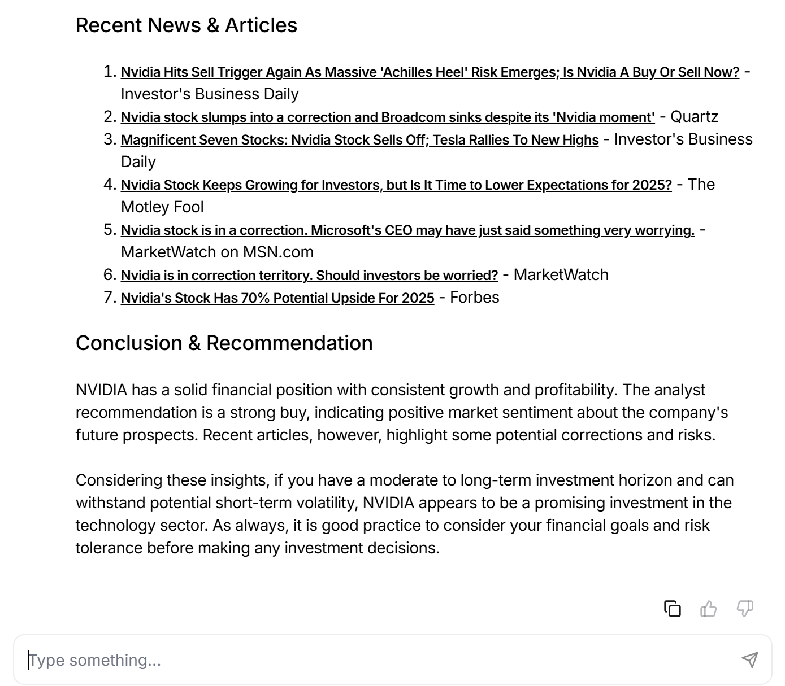

# Stock Investment Agent

## Description

Ce projet propose un agent intelligent composé de deux modules principaux :

Web Agent : Un agent spécialisé dans la collecte des sources des articles les plus récents sur une entreprise choisie.

Finance Agent : Un agent qui analyse des données financières (cours des actions, recommandations d'analystes, informations sur l'entreprise, etc.) pour évaluer les opportunités d'investissement.

L’application inclut une interface utilisateur intuitive qui permet d’afficher les résultats de manière claire et lisible.

## Fonctionnalités principales

Analyse financière :

- Obtention des prix des actions.
- Recommandations des analystes financiers.
- Informations et actualités récentes sur les entreprises.

Recherche d’articles récents :

- Utilisation de DuckDuckGo pour collecter des articles récents concernant une entreprise.
- Présentation des résultats avec des sources fiables.

Interface utilisateur (UI) :

- Une interface utilisateur conviviale permet de visualiser les données présentées sous forme de tableaux et de textes bien formatés.

Centralisation des agents :

- Un agent d’équipe combine les compétences du Web Agent et du Finance Agent pour une prise de décision globale.

## Installation

1. Clonez le repository
2. Créez un environnement virtuel
3. Installez les dépendances: `pip install -r requirements.txt`
4. Configurer les variables d’environnement :
   Créez un fichier .env à la racine du projet et ajoutez les clés nécessaires pour votre modèle OpenAI.
   OPENAI_API_KEY=VotreCleAPI

## Utilisation

Exécutez les fichiers python d'agents IA.

Pour utiliser l'interface graphique, exécutez :
`phi auth` connectez vous puis,
`pip install 'fastapi[standard]' sqlalchemy`
`python playground.py`

Et naviguez vers :
`http://phidata.app/playground`

Sélectionnez `localhost:7777` comme endpoint pour commencer à interagir avec vos agents.

L'interface utilisateur présente les résultats sous forme de graphiques interactifs et de tableaux. Vous pouvez rechercher une entreprise, afficher ses articles récents et analyser ses performances financières.

### Exemple 1 : Total Energie & Sanofi Metrics

- Ce graphique montre la comparaison des métriques financières de Total Energie et Sanofi.

### Exemple 2 : NVIDIA informations

- L'onglet "Informations" présente les dernières nouvelles sur NVIDIA.

### Exemple 3 : NVIDIA recommandations

- L'onglet "Recommandations" fournit les conseils des analystes financiers sur NVIDIA.
